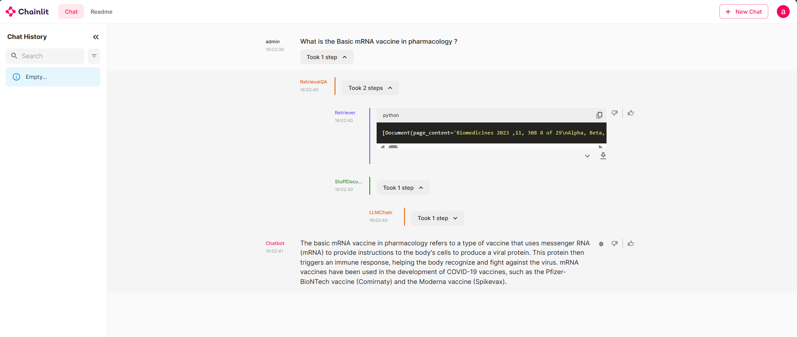

# LLM-Test-Instadeep
LLM - Technical Test for the Instadeep internship

## Objective
This technical test involves designing an application to assist a researcher in updating their paper based on the latest advancements in the field. The application utilizes Natural Language Processing techniques to recommend relevant papers to augment a set of input paragraphs.

I decided to develop two applications, one for the summarization and paper recommendation tasks and another for a question/answer task based on our vector database built from our papers.

### The main files are "app.py" and "app_qa.py" for the app execution and the jupyter notebook for the steps, details, choices and evaluation. 

## How to Run

### Prerequisites
Ensure you have Python installed on your machine.

### Installation
1. Open a terminal or command prompt.
2. Navigate to the project directory.
3. Run the following command to install the required packages from 'requirements.txt':
```bash
pip install -r requirements.txt
```
4. Once on the application, use "admin" as a username and a password.  


### Running the Application
To run the main app for the paper summarization and recommendation, use:
```bash
chainlit run app.py
```


To run the Question Answering RAG retriever application, use:
```bash
chainlit run app_qa.py
```


## Implementation Overview
The implemented solution utilizes various Python libraries and techniques to achieve the specified tasks:

### Packages and Techniques Used
* **langchain**: A toolkit that encompasses document loaders, embeddings, text splitters, vector stores, summarization chains, and chat models, facilitating the handling of text data and NLP tasks.<br>
* **PyPDF2**: A library for handling PDF files and extracting text content from them.<br>
* **Chroma**: Utilized as a vector store to create a database of embeddings for efficient document retrieval based on similarity.<br>
* **Hugging Face Transformers**: Specifically, the allenai/scibert_scivocab_uncased model is used for generating embeddings tailored for scientific papers.<br>
* **OpenAI's GPT-3.5**: Integrated via the ChatOpenAI model for text summarization.

### Why allenai/scibert_scivocab_uncased for Embeddings
The choice of the allenai/scibert_scivocab_uncased model for scientific paper embeddings is due to its specialization in understanding scientific vocabulary and context. This model is pre-trained on a vast corpus of scientific texts, enabling it to capture domain-specific nuances and relationships, which is crucial for accurately recommending related papers.

### GPT-3.5 for Summarization
The utilization of GPT-3.5 for summarization tasks is based on its state-of-the-art capabilities in understanding and generating human-like text. It excels in condensing and summarizing lengthy documents effectively, which aligns with the need to provide paper summaries based on user input.

## Implementation Details
* The application initializes by setting up the necessary environment variables and components, including loading environment variables and defining paths and collection names for data storage.<br>
* Summarization of uploaded PDFs is performed using PyPDF2 to extract text content, followed by text splitting and summarization through a chain built with langchain's tools.<br>
* Authentication logic for users is implemented for access control.<br>
* Upon uploading a PDF, the application processes it, generates a summary using GPT-3.5, and displays it to the user.<br>
* Recommendations of relevant papers based on user input are made utilizing the vector database created using Chroma.<br>

## Evaluation Pipeline
An evaluation pipeline for assessing the quality and accuracy of the output could be added by incorporating metrics such as precision, recall, or similarity scores between recommended papers and user-inputted paragraphs.
